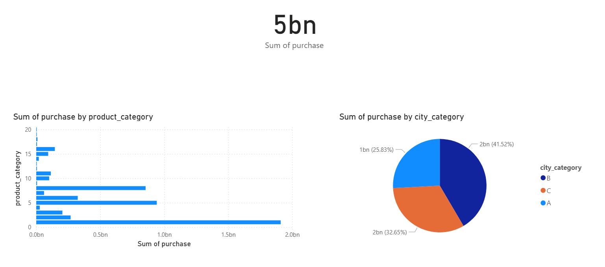
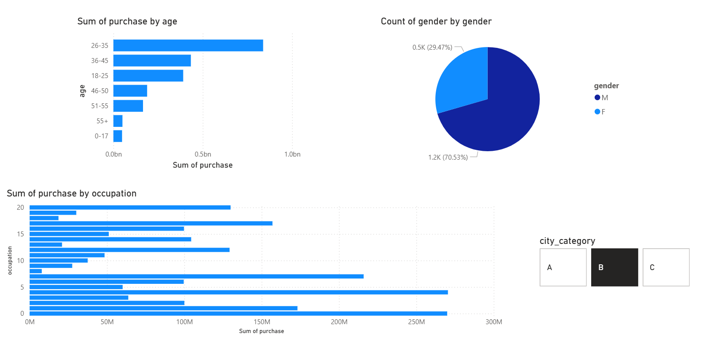

# 🛒 Walmart Analytics Pipeline with dbt

This project is an end-to-end data analytics pipeline built using **dbt**, powered by a Walmart sales dataset. The pipeline transforms raw transactional data into clean, tested, and documented models ready for BI and reporting.

🧑‍💻 Author
Built with ❤️ by Shaheryar
Data Engineering & Analytics enthusiast
---

## 🚀 Tech Stack

- **dbt-core**
- **PostgreSQL**
- **Power BI** (optional)
- **Python (venv)** for local environment

---

## 📁 Project Structure
        walmart-dbt-analytics/
        │
        ├── ecommerce_analytics/
        │   ├── assets/
        │   │   ├── png1.png
        │   │   ├── png2.png
        │   │   ├── png3.png
        │   ├── analyses/
        │   ├── macros/
        │   ├── models/
        │   ├── seeds/
        │   ├── snapshots/
        │   ├── tests/
        │   ├── README.md
        │   ├── dbt_project.yml
        │   └── walmart_BI.pbix
        │
        ├── .gitignore
        └── README.md  ✅ ← root readme


---

## 📊 Data Models

### 1. `walmart_raw` (Source)
- Raw data loaded from CSV into PostgreSQL

### 2. `stg_walmart_raw`
- Cleaned and typed version of the source

### 3. `dim_customers`
- Unique customers with attributes like age, gender, city, occupation

### 4. `dim_products`
- Unique products and their category

### 5. `fct_sales`
- Fact table with purchase metrics

---

## 🧪 Tests Implemented

- `not_null` tests on all critical fields
- `relationships` test: `fct_sales.user_id` → `dim_customers.user_id`
- (Optional) `accepted_values` test on purchase (for demo)
- Source freshness and model documentation planned

Run tests via:

<br> <pre> ```bash dbt test ``` </pre>

## 📊 E-commerce Analytics Dashboard (Power BI)

This project leverages `dbt`, PostgreSQL, and Power BI to create an analytics dashboard based on Walmart-style customer transactions. The data model is built using fact/dimension modeling with dbt and visualized using Power BI.

---

### 📈 Page 1: Executive Summary

This page gives a high-level overview of customer behavior and key purchasing patterns.

#### ✅ Visuals:
- **Total Purchase Amount** (Card)
- **Purchase by Product Category** (Bar Chart)
- **Purchase Distribution by City Category** (Pie Chart)

#### 📌 Key Insights:
- Total sales exceed **5 billion** units.
- **Product Category 1** dominates with the highest sales volume.
- **City Category B** has the most active buyers (41.5%).

🖼 **Screenshot:**
 

---

### 👥 Page 2: Customer Insights

Focuses on demographic and behavioral breakdowns.

#### ✅ Visuals:
- **Purchase by Age Group** (Bar Chart)
- **Customer Count by Gender** (Pie Chart)
- **Purchase by Occupation** (Horizontal Bar)
- **City Category Slicer** for interactivity

#### 📌 Key Insights:
- Age group **26–35** contributes the most to total purchases.
- Gender distribution is skewed towards **Male (70%)**.
- Occupation IDs **0, 4, and 17** show the highest purchasing power.

🖼 **Screenshot:**


---

## ✅ Tech Stack

- **PostgreSQL**: Raw data storage
- **dbt**: Data modeling (dimensions, facts, testing, documentation)
- **Power BI**: Data visualization and analysis

---

## 🚀 Next Steps
➡️ Page 3: Product Deep Dive (In progress)

---

## 🧠 Author
Built with 💻 by [@AppleShay](https://github.com/AppleShay)


